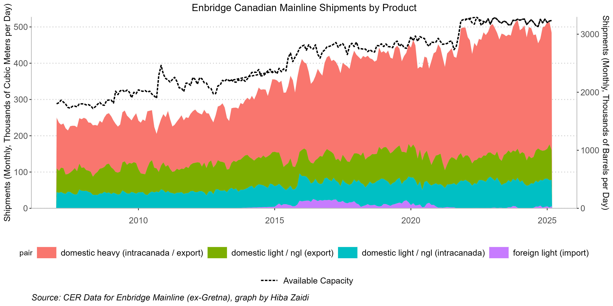
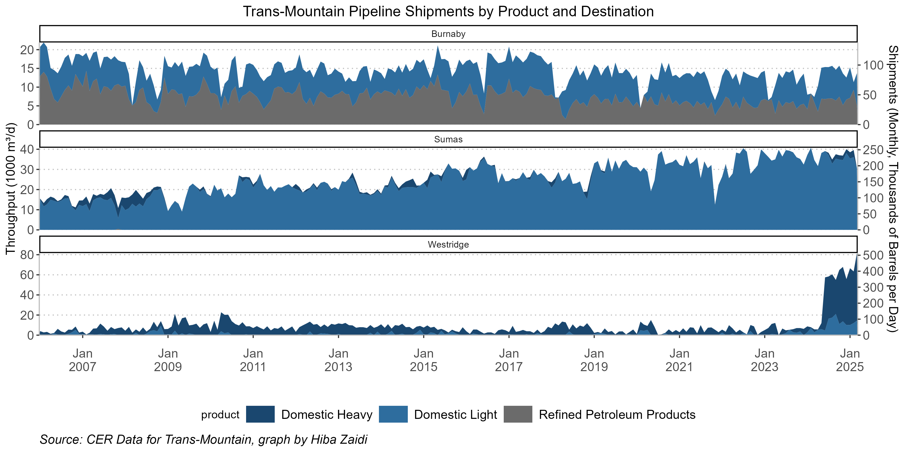
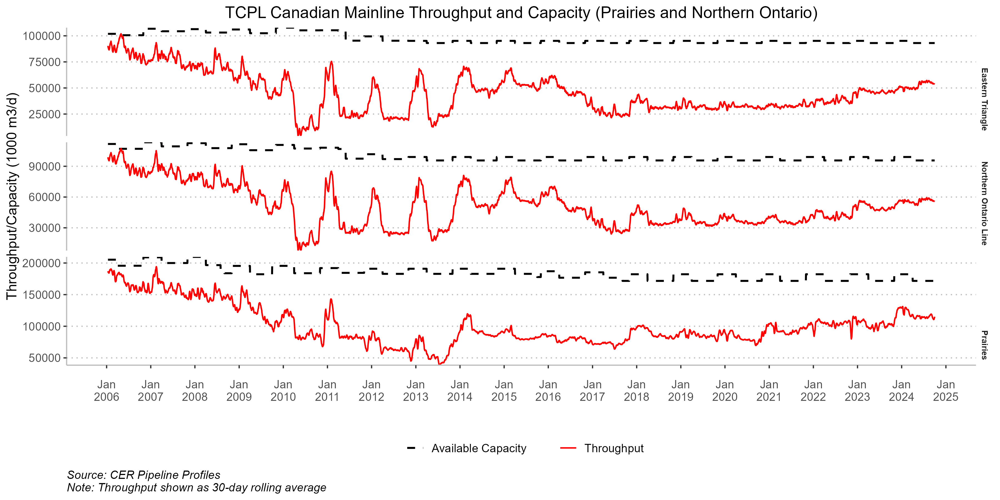
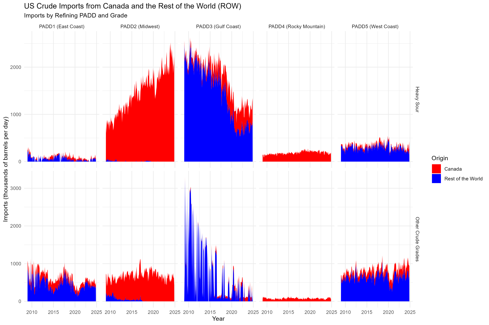
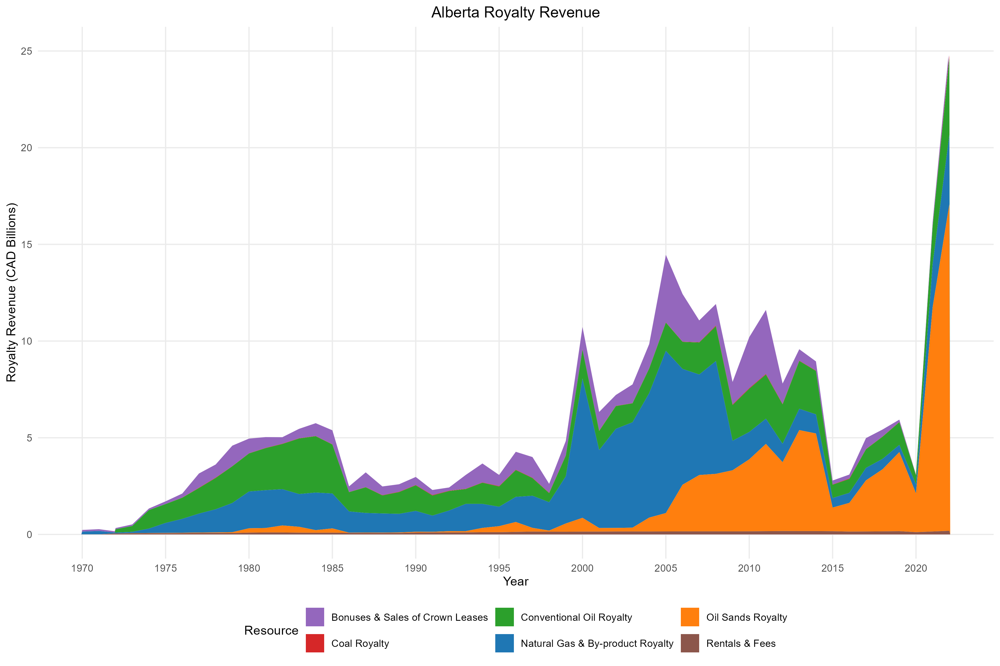

# Canadian-Pipeline-Throughput-Visualizations

This project was completed as part of ECON 366 (Energy Economics) at the University of Alberta. It analyzes historical throughput and capacity data from three major Canadian pipelines—Enbridge Mainline, Trans Mountain, and TCPL Mainline—using CER datasets. The assignment emphasizes applied data cleaning, R-based visualization, and infrastructure-specific insight into the flow of crude oil and refined products across Canada.

## Deliverables

### 1. Enbridge Mainline Throughput by Product

> This plot shows monthly shipments through the Enbridge Mainline by product type, with dual-axis conversion to barrels/day.

---

### 2. Trans Mountain Shipments by Product and Destination

> Area chart visualizing shipment volumes at Burnaby, Sumas, and Westridge terminals by product type.

---

### 3. TCPL Mainline: Throughput vs. Capacity

> Rolling-average throughput vs. nameplate capacity at three key points on the TCPL mainline. Annotated with stylized themes and clear faceting.

---

### 4. U.S. Crude Imports by Origin

> This area plot shows Canadian vs. Rest of World (ROW) crude imports by U.S. refining PADD and grade.

---

### 5. Alberta Royalty Revenue (1970–2023)

> Historical visualization of Alberta's royalty revenues across six key resource categories. Y-axis scaled in billions of CAD.

---

## Tools & Packages Used

- **R** (`tidyverse`, `ggplot2`, `lubridate`, `janitor`, `zoo`)
- **Data Sources**:
  - Canada Energy Regulator (CER)
  - Open CER CSV Downloads (throughput & capacity)

